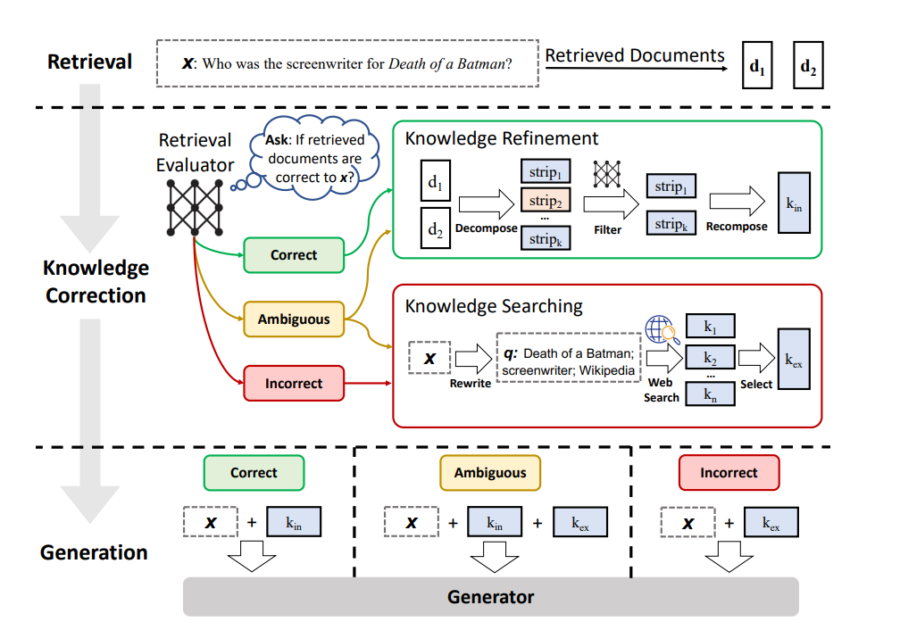

# Corrective Retrieval-Augmented Generation (CRAG)

This project implements **Corrective Retrieval-Augmented Generation (CRAG)**, an advanced RAG framework designed to improve the reliability of Retrieval-Augmented Generation systems by evaluating retrieved knowledge and applying corrective actions when retrieval quality is insufficient.

The implementation is based on the research paper:

**Corrective Retrieval Augmented Generation**  
Yan et al., 2024

Paper:
https://arxiv.org/pdf/2401.15884

---

# Project Overview

Retrieval-Augmented Generation (RAG) systems rely on external knowledge retrieval to improve LLM responses. However, retrieved documents may contain irrelevant, incomplete, or incorrect information, which can lead to hallucinations and unreliable answers.

CRAG introduces a self-corrective mechanism that evaluates retrieval quality before generating responses.

This implementation explores the complete CRAG workflow:

- Retrieval evaluation
- Knowledge refinement
- Query rewriting
- Web search correction
- Ambiguous retrieval handling
- Final response generation

---

# CRAG Workflow Architecture

The implemented pipeline follows a corrective retrieval strategy where the system dynamically decides how to process retrieved information.



The workflow consists of:

1. Retrieve relevant documents from the knowledge base.
2. Evaluate retrieved document quality.
3. Select an appropriate corrective action:
   - Use internal knowledge when retrieval is sufficient.
   - Perform query rewriting and web search when retrieval fails.
   - Combine multiple sources when retrieval is ambiguous.
4. Refine the retrieved context.
5. Generate the final response.

---

# Implementation Pipeline

## 1. Basic RAG Pipeline

Notebook:

```
1_Basic_RAG.ipynb
```

Implements the baseline RAG system:

- PDF document loading
- Document chunking
- Embedding generation
- FAISS vector database
- Similarity-based retrieval
- LLM response generation

This provides the foundation for the corrective RAG pipeline.

---

## 2. Retrieval Refinement

Notebook:

```
2_Retrieval_Refinement.ipynb
```

Introduces knowledge refinement using:

```
Decompose → Filter → Recompose
```

Process:

- Split retrieved context into sentences.
- Evaluate sentence relevance.
- Remove unnecessary information.
- Reconstruct refined context.

This reduces irrelevant context before answer generation.

---

## 3. Retrieval Evaluation

Notebook:

```
3_Retrieval_Evaluator.ipynb
```

Adds an LLM-based retrieval evaluator.

Each retrieved chunk receives a relevance score:

```
0.0 → Irrelevant
1.0 → Highly Relevant
```

Based on evaluation results, retrieval is classified as:

### CORRECT

Retrieved documents contain sufficient information.

Flow:

```
Retrieval
    ↓
Refinement
    ↓
Generation
```

---

### INCORRECT

Retrieved documents are insufficient.

Flow:

```
Retrieval
    ↓
Query Rewrite
    ↓
Web Search
    ↓
Refinement
    ↓
Generation
```

---

### AMBIGUOUS

Retrieved documents contain uncertain relevance.

Flow:

```
Internal Knowledge
        +
External Knowledge
        ↓
Context Refinement
        ↓
Generation
```

---

## 4. Web Search Refinement

Notebook:

```
4_Web_Search_Refinement.ipynb
```

Adds external knowledge retrieval using web search.

When internal retrieval fails:

- Search the web.
- Convert results into documents.
- Refine information.
- Generate a response.

---

## 5. Query Rewrite

Notebook:

```
5_Query_Rewrite.ipynb
```

Improves retrieval by rewriting unsuccessful queries.

Workflow:

```
Original Question
        ↓
Query Rewrite Model
        ↓
Optimized Search Query
        ↓
Web Retrieval
        ↓
Refinement
        ↓
Answer Generation
```

---

## 6. Ambiguous Handling

Notebook:

```
6_Ambiguous.ipynb
```

Handles uncertain retrieval scenarios.

The system combines:

- Retrieved internal documents
- External web information

before final response generation.

---

# Technology Stack

| Component | Technology |
|---|---|
| Programming Language | Python |
| LLM Framework | LangChain |
| Workflow Engine | LangGraph |
| Vector Database | FAISS |
| Embedding Model | Jina Embeddings |
| Large Language Model | Google Gemini |
| Web Search | Tavily |
| Data Validation | Pydantic |

---

# Project Structure

```
Corrective RAG (CRAG)
│
├── README.md
├── CRAG_workflow.png
│
├── documents/
│   ├── book1.pdf
│   └── book_2.pdf
│
├── 1_Basic_RAG.ipynb
├── 2_Retrieval_Refinement.ipynb
├── 3_Retrieval_Evaluator.ipynb
├── 4_Web_Search_Refinement.ipynb
├── 5_Query_Rewrite.ipynb
└── 6_Ambiguous.ipynb
```

---

# Environment Setup

Install dependencies:

```bash
pip install -r requirements.txt
```

Create a `.env` file:

```env
GOOGLE_API_KEY=your_google_api_key
JINA_API_KEY=your_jina_api_key
TAVILY_API_KEY=your_tavily_api_key
```

---

# Execution Order

Run notebooks sequentially:

```
1_Basic_RAG.ipynb
        ↓
2_Retrieval_Refinement.ipynb
        ↓
3_Retrieval_Evaluator.ipynb
        ↓
4_Web_Search_Refinement.ipynb
        ↓
5_Query_Rewrite.ipynb
        ↓
6_Ambiguous.ipynb
```

---

# Reference Paper

Yan et al.

**Corrective Retrieval Augmented Generation**

arXiv:2401.15884 (2024)

https://arxiv.org/pdf/2401.15884

---

# Author

**Shahab Afridi**

GitHub:  
https://github.com/ShahaB-AfriDy