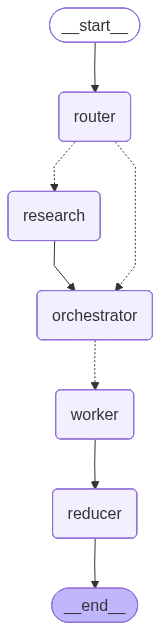

# Research RAGs and Writing Blog

An AI-powered **Research and Blog Writing Assistant** built using Retrieval-Augmented Generation (RAG), Large Language Models (LLMs), web search, prompt engineering, and multimodal generation techniques.

This project explores how RAG systems can be extended from traditional question answering into **automated research, knowledge-grounded writing, and content generation workflows**.

The system assists users in transforming a topic idea into a structured, research-based blog article with improved factual grounding and optional image generation.

---

# Project Overview

Large Language Models are powerful content generators, but they have limitations:

- Limited access to recent information.
- Potential hallucination of facts.
- Lack of source-based reasoning.
- Difficulty maintaining research depth in long-form writing.

This project addresses these challenges by integrating:

- Retrieval-Augmented Generation (RAG)
- Web-based information retrieval
- Advanced prompt engineering
- Research-oriented content generation
- Fine-tuned generation approaches
- Image generation for enriched blog content

---

# Workflow Architecture

The overall workflow of the Blog Writing Assistant is:



The pipeline follows:

```
User Topic / Idea
        |
        v
Research & Information Retrieval
        |
        v
Knowledge Processing
        |
        v
Prompt Engineering
        |
        v
LLM Blog Generation
        |
        v
Content Enhancement
        |
        v
Images + Final Blog Output
```

---

# Project Goals

The main objectives of this project are:

- Build an AI assistant for research-based writing.
- Improve LLM responses using retrieved knowledge.
- Compare different prompting strategies.
- Explore fine-tuning approaches for specialized writing.
- Combine text and image generation.
- Develop an end-to-end AI content creation workflow.

---

# Implementation Components

## 1. Basic Blog Writing Assistant

Notebook:

```
1_bwa_basic.ipynb
```

This notebook implements the initial Blog Writing Assistant pipeline.

Features:

- User topic input
- Basic LLM generation
- Initial blog structure creation
- Simple content generation workflow

Purpose:

Provides the baseline system for further improvements.

---

# 2. Improved Prompting Strategy

Notebook:

```
2_bwa_improved_prompting.ipynb
```

This version improves generation quality through prompt engineering.

Implemented improvements:

- Better role definition
- Structured instructions
- Improved article organization
- More consistent writing style
- Enhanced output quality

Focus:

Understanding how prompt design affects LLM-generated content.

---

# 3. Research-Based Blog Generation

Notebook:

```
3_bwa_research.ipynb
```

Introduces research capabilities using Retrieval-Augmented Generation.

Workflow:

```
User Topic
    |
    v
Information Retrieval
    |
    v
Knowledge Augmentation
    |
    v
Research-Based Blog Generation
```

Features:

- External knowledge retrieval
- Research-driven writing
- Better factual grounding
- Improved content depth

---

# 4. Fine-Tuned Research Writing

Notebook:

```
4_bwa_research_fine_tuned.ipynb
```

Explores fine-tuning approaches for specialized blog generation.

Objectives:

- Improve writing consistency
- Adapt models for research-style content
- Explore domain-specific generation

This notebook investigates how model adaptation can improve specialized writing tasks.

---

# 5. Image-Enhanced Blog Generation

Notebook:

```
5_bwa_image.ipynb
```

Extends the system with multimodal generation.

Capabilities:

- Generate supporting images
- Improve blog presentation
- Combine textual and visual content

This creates a richer content-generation experience.

---

# 6. Tavily Search Experiments

Notebook:

```
tavily_test.ipynb
```

Contains experiments for web retrieval using Tavily Search.

Purpose:

- Test external information retrieval.
- Evaluate search results.
- Support research-based generation.

---

# Application Architecture

## Backend

File:

```
bwa_backend.py
```

Responsible for:

- Retrieval pipeline
- LLM interaction
- Research workflow
- Blog generation logic
- Processing retrieved information

---

## Frontend

File:

```
bwa_frontend.py
```

Provides the user interaction layer.

Responsibilities:

- User input handling
- Triggering generation pipeline
- Displaying generated content

---

# Technology Stack

| Component | Technology |
|---|---|
| Programming Language | Python |
| LLM Framework | LangChain |
| Workflow Management | LangGraph |
| Large Language Model | Google Gemini |
| Retrieval System | RAG Pipeline |
| Web Search | Tavily |
| Embeddings | Vector Embeddings |
| Multimodal Generation | Image Generation Models |

---

# Project Structure

```
Research RAGs and Writing Blog
│
├── README.md
├── workflow_diagram.png
│
├── 1_bwa_basic.ipynb
├── 2_bwa_improved_prompting.ipynb
├── 3_bwa_research.ipynb
├── 4_bwa_research_fine_tuned.ipynb
├── 5_bwa_image.ipynb
│
├── bwa_backend.py
├── bwa_frontend.py
│
└── tavily_test.ipynb
```

---

# Key Concepts Explored

## Retrieval-Augmented Generation (RAG)

Using external knowledge sources to improve:

- Accuracy
- Reliability
- Research quality

---

## Prompt Engineering

Experimenting with:

- Instruction design
- Structured generation
- Role prompting
- Output optimization

---

## Research Automation

Automating:

- Information collection
- Knowledge organization
- Long-form article generation

---

## Multimodal AI

Combining:

- Text generation
- Image generation

to create richer AI-generated content.

---

# Future Improvements

Potential extensions:

- Automatic citation generation
- Multi-agent research workflow
- Advanced RAG evaluation
- Source credibility scoring
- Long-document research pipelines
- Production deployment
- User authentication and cloud hosting

---

# Author

**Shahab Afridi**

Research interests:

- Retrieval-Augmented Generation (RAG)
- Large Language Models (LLMs)
- AI Agents
- Natural Language Processing
- Generative AI Applications

Contact:

📧 shahabafridy@gmail.com